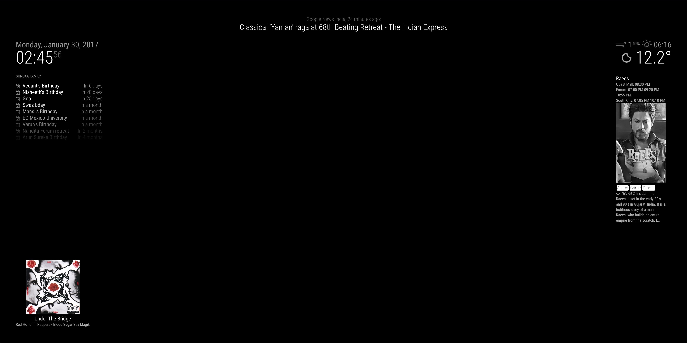

# MMM-BookMyShow
A module to scrape <a href="https://in.bookmyshow.com">BookMyShow</a> content into the <a href="https://github.com/MichMich/MagicMirror">MagicMirror<sup>2</sup></a>. Likely to break when BookMyShow modifies its UI. Unfortunately, BookMyShow does not provide an API.

## Preview


## Dependencies
  * An installation of [MagicMirror<sup>2</sup>](https://github.com/MichMich/MagicMirror)
  * npm
  * [moment](https://www.npmjs.com/package/moment)

## Installation
 1. Clone this repo into `~/MagicMirror/modules` directory.
 2. Configure your `~/MagicMirror/config/config.js` as described in the configuration section below
 3. Run command `npm install` in `~/MagicMirror/modules/MMM-BookMyShow` directory.
 4. Install the following Python modules via `pip`:
 ```
 pip install lxml
 pip install requests
 ```
 
## Configuration
Many thanks to <a href="https://github.com/fewieden">`feweiden`</a> and his wonderful <a href="https://github.com/fewieden/MMM-MovieInfo">`MMM-MovieInfo`</a> module which formed the base code for this module.
Add `MMM-BookMyShow` module to the `modules` array in the `config/config.js` file:
````javascript
modules: [
  {
  	module: 'MMM-BookMyShow',
  	position: 'top_right',
  	config: {
  		rotateInterval: 30000	// 30 seconds
  	}
  },
]
````

## Config Options
| **Option** | **Default** | **Description** |
| --- | --- | --- |
| `updateInterval` | `10800000` (3 hours) | How often new data should be fetched. (Changes only once per day) |
| `rotateInterval` | `180000` (3 mins) | How fast should be rotated between movies |
| `genre` | `true` | Display genres of movies. |
| `rating` | `true` | Display rating of movies. |
| `plot` | `true` | Display plot of movies. |
